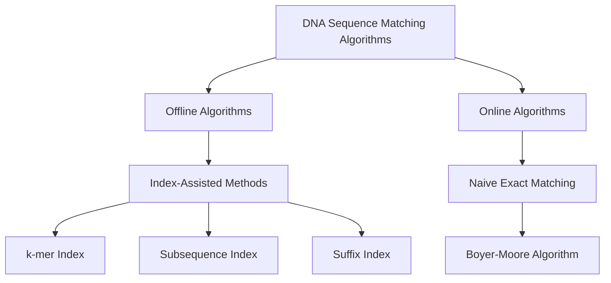

## DNA String Components

- **Substring:**  
  A continuous block of bases from the DNA string. Every prefix and suffix is also a substring.

- **Complement:**  
  A DNA sequence formed by replacing each base with its complementary base:  
  `A ↔ T` and `C ↔ G`.  
  Example: Complement of `GATTACA` → `CTAATGT`.

- **Reverse Complement:**  
  The **reverse** of the complement sequence, representing the DNA strand running in the opposite 3'→5' direction.  
  Example: Reverse complement of `GATTACA` → `TGTAATC`.

- **Motif:**  
  A short recurring sequence pattern (e.g., `TATA` box) that often has biological significance, such as binding sites for proteins.

- **K-mer:**  
  A substring of length *k* within a DNA sequence. For example, 3-mers of `GATTACA` are `GAT`, `ATT`, `TTA`, `TAC`, `ACA`.

- **GC Content:**  
  The proportion of **G** and **C** bases in a DNA sequence, often used to assess sequence stability.

- **Read:**  
  A short DNA fragment obtained from sequencing technologies that represents part of the original genome.

- **Subsequence:**  
  A sequence formed by deleting zero or more characters from a DNA string **without changing the order** of the remaining bases.  
  Example: For `GATTACA`, possible subsequences include `GTA`, `GAA`, or `ATT`.

- **Prefix:**  
  A substring that starts from the **first base** of the DNA string.  
  Example (prefixes of `GATTACA`): `G`, `GA`, `GAT`, `GATT`, `GATTA`, `GATTAC`, `GATTACA`.

- **Suffix:**  
  A substring that ends at the **last base** of the DNA string.  
  Example (suffixes of `GATTACA`): `A`, `CA`, `ACA`, `TACA`, `TTACA`, `ATTACA`, `GATTACA`.

- **Offset:**
  The offset of a pattern in a genome (or text) is the 0-based index of the first character where the pattern begins.

For example, if the genome is
Genome:  A G C T T A G A T A G C
Index:   0 1 2 3 4 5 6 7 8 9 10

and the pattern TAG starts at position 5 (T in position 5),then the offset is 5.

- **Leftmost Occurrence:**
  The leftmost occurrence means the smallest offset where a pattern (or its reverse complement) appears in the genome.
  If a pattern occurs multiple times, we report the first (lowest index) occurrence.
  When both the pattern and its reverse complement are searched:
  We find the earliest offset across both.
  Example:
  Pattern ACTAAGT occurs at offset 40
  Reverse complement ACTTAGT occurs at offset 29
  ✅ The leftmost occurrence is 29


## 🧬 Introduction to Sequence Reads in FASTQ Format

The **FASTQ** format is a standard text-based file format used to store both **biological sequence data** (usually DNA or RNA reads) and their corresponding **quality scores** generated by high-throughput sequencing platforms such as Illumina. Each read in a FASTQ file is represented by **four lines**:

1. **Header line** — begins with `@`, followed by a sequence identifier and optional description.  
2. **Sequence line** — contains the raw nucleotide sequence (e.g., A, T, G, C, or N).  
3. **Separator line** — begins with a `+` symbol, and may optionally repeat the identifier from the header.  
4. **Quality score line** — encodes the quality of each base in the sequence, using ASCII characters that represent Phred quality scores.

Each set of four lines corresponds to one read. The quality scores are crucial for downstream analyses because they indicate the confidence of each base call.

**Example:**
@SEQ_ID
GATTACA
+
IIIIIII

Here:
- `@SEQ_ID` is the identifier of the sequence read.  
- `GATTACA` is the nucleotide sequence.  
- `IIIIIII` represents the quality scores, where each “I” encodes a high Phred score (indicating high confidence).


## 🧬 Base Qualities in FASTQ Files

In FASTQ files, **base quality scores** represent the confidence that a base (A, T, G, or C) has been correctly identified by the sequencing machine.  
These scores are typically encoded using the **Phred+33** ASCII scheme.

### 🔢 ASCII Encoding: "Phred+33"

To store quality scores efficiently as text:
1. Take the Phred quality score **Q** (an integer).
2. Add **33** to it.
3. Convert the resulting number into its corresponding **ASCII character**.

This allows each quality score to be represented by a single printable character in the FASTQ file.

---

### 🧩 Python Functions for Conversion

```python
def QtoPhred33(Q):
    """Turn Q into Phred+33 ASCII-encoded quality"""
    return chr(Q + 33)
```
Converts an integer quality score (Q) into its ASCII character form.
chr() converts an integer to its ASCII character.
Example:
Q = 40 → 40 + 33 = 73 → chr(73) → 'I'

```python
def phred33ToQ(qual):
    """Turn Phred+33 ASCII-encoded quality into Q"""
    return ord(qual) - 33
```
Converts a Phred+33 encoded character back to its integer quality score.
ord() converts a character to its ASCII integer value.
Example:
qual = 'I' → ord('I') = 73 → 73 - 33 = 40

Summary

Phred score (Q) indicates sequencing accuracy.

Phred+33 encoding allows quality values to be stored compactly as ASCII text.

chr() and ord() are inverse functions that translate between integers and characters.


---

### 🧮 Approximate Matching


---

### 🧭 Explanation
- **Offline algorithms**  
  - Preprocess the DNA sequence **before** searching (build an index).  
  - Include:
    - **k-mer index**: stores all k-length substrings.
    - **Subsequence index**: stores sampled k-mers (skipping positions).
    - **Suffix index**: stores all suffixes of the DNA sequence.

- **Online algorithms**  
  - Search the pattern **directly** without pre-built index.  
  - Include:
    - **Naive exact matching**: checks every possible position.
    - **Boyer-Moore**: skips unnecessary comparisons using preprocessing of the pattern.

---


---

### 🧮 Naive Exact Matching Algorithm

We compare `P` to every possible substring of `T` of the same length.

**Algorithm Steps:**
1. For each possible alignment (offset) of `P` in `T`:
   - Compare each character in `P` with the corresponding character in `T`.
2. If all characters match → record this offset as a **match**.
3. If any mismatch occurs → move to the next alignment.

This is known as the **naive exact matching** approach.

---

### 🧰 Python Implementation Outline
```python
def naive(P, T):
    occurrences = []
    for i in range(len(T) - len(P) + 1):  # all possible alignments
        match = True
        for j in range(len(P)):           # compare characters
            if T[i + j] != P[j]:
                match = False
                break
        if match:
            occurrences.append(i)
    return occurrences
```
⚙️ Computational Complexity

Let:

x = length(P)

y = length(T)

Number of alignments:
y - x + 1

Worst-case character comparisons:
x * (y - x + 1)
Occurs when every character matches (i.e., pattern perfectly aligns everywhere).

Best-case character comparisons:
y - x + 1
Occurs when the first character mismatches at every alignment.

💡 Examples

Worst case: pattern and text share identical or repetitive characters → every alignment requires full comparison.

Best case: pattern starts with a letter not present in the text → immediate mismatch each time.

Example text:

P = "word"
T = "there would have been a time for such a word"


→ Total comparisons: 46
(40 mismatches + 6 matches)

📈 Key Insights
Case	Description	Comparisons
Best	First character mismatches each time	y - x + 1
Worst	Every character matches	x * (y - x + 1)
Typical	Most comparisons close to the minimum in real data	Much closer to best case

🧩 Summary

The naive exact matching algorithm tests every possible alignment between a pattern and a text.
Despite its simplicity, it provides the foundation for more advanced pattern matching and read alignment algorithms used in genomics.
In most real cases, the algorithm performs closer to the best-case scenario rather than the worst-case.


→ Practice
```
How many character comparisons occur when matching P = AAA to T = AAATAA?
```
Given:
Pattern P = "AAA" (length x = 3)
Text T = "AAATAA" (length y = 6)

1️⃣ Number of possible alignments
We can align P against T at:
y−x+1=6−3+1=4

So offsets = 0, 1, 2, 3

2️⃣ Check each alignment
Offset 0
T: AAATAA
P: AAA
   ↑↑×        (compare 3 chars)

A==A ✅
A==A ✅
A==T ❌
→ 2 matches + 1 mismatch = 3 comparisons

Offset 1
T: AAATAA
    AAA
    ↑↑×

A==A ✅
A==A ✅
A==A ✅
→ 3 comparisons (full match)

Offset 2
T: AAATAA
     AAA
     ↑×

A==A ✅
A==T ❌
→ 2 comparisons

Offset 3
T: AAATAA
      AAA
      ↑↑×

T==A ❌
→ 1 comparison

3️⃣ Total number of character comparisons
3+3+2+1=9

🧩 Summary
If the pattern has length x and the text has length y,
✅ Minimum possible number of comparisons:
y−x+1 (only one comparison per alignment — immediate mismatch)
✅ Maximum possible number of comparisons:
x×(y−x+1)


## Boyer-Moore Basics
### Difference Between Naive and Boyer-Moore String Matching


---

## 1. Naive Matching
- **Method**: Start from the first character of the text, align the pattern, and compare character by character. Move one position at a time.
- **Features**:
  - Simple and easy to implement.
  - Comparison always starts from the first character of the pattern.
  - Worst-case time complexity: \(O(nm)\), where \(n\) is the text length and \(m\) is the pattern length.
## Example DNA Sequence
- **Text (DNA strand)**: `GATTACAGATTACA`
- **Pattern**: `TACA`
- **Process**:
  1. Compare `GATT` → mismatch → shift 1
  2. Compare `ATTA` → mismatch → shift 1
  3. Compare `TTAC` → mismatch → shift 1
  4. Compare `TACA` → match found


---

## 2. Boyer-Moore (BM) Matching
- **Method**: Compare the pattern from **right to left**. When a mismatch occurs, use **Bad Character Rule** or **Good Suffix Rule** to skip several positions instead of shifting one by one.
- **Features**:
  - Uses information from mismatches to **jump ahead**, improving efficiency.
  - Particularly efficient for long texts and patterns.
  - Worst-case complexity: \(O(nm)\), but average-case is close to \(O(n/m)\).
- **Rules**:
  - **Bad Character Rule**: Shift the pattern so that the mismatched character in the text aligns with the last occurrence in the pattern.
  - **Good Suffix Rule**: Shift the pattern so that the matched suffix aligns with the next occurrence in the pattern.
  
## Example DNA Sequence
- **Text (DNA strand)**: `GTTATAGCTGATCGCGGCGTAGCGGCG`
- **Pattern**: `GTAGCGGCG`
- **Process with DNA Example**:
  1. Start with `GTTATAGCT` at the beginning: compare from right `'T'` → mismatch
  2. Apply **Bad Character Rule** → T mismatch, T in the pattern is the 8th, shift 8 to the right
     - `GTTATAGCTGATCGCGGCGTAGCGGCG`
     - `        GTAGCGGCG          `
  3. Compare again → match `GCG` (**good suffix Rule**) → DNA after GCG, C mismatch G in pattern
  4. if using **Bad Character Rule**, no alignment will be skipped, thus we use **good suffix Rule** to skip 2 alignments (use the maximum)
     - `GTTATAGCTGATCGCGGCGTAGCGGCG`
     - `           GTAGCGGCG        `
  5. `'GCGGCG'` → match (nect DNA text `'C'` mismatch)
  6.if using **Bad Character Rule**, 2 alignment will be skipped, thus we use **good suffix Rule** to skip 7 alignments (use the maximum)
     - `GTTATAGCTGATCGCGGCGTAGCGGCG`
     - `                   GTAGCGGCG `
  7. match
---

## 3. Summary of Differences

| Feature | Naive | Boyer-Moore |
|---------|-------|-------------|
| Comparison direction | Left to right | Right to left |
| Shift strategy | Move 1 position at a time | Jump multiple positions using rules |
| Time efficiency | Slow in worst-case | Fast on average, especially for long text |
| Implementation difficulty | Simple | More complex |

---


# DNA String Matching Concepts

---

## 1. Preprocessing: Offline vs Online

### **Offline Preprocessing**
- **Definition**: The reference DNA (e.g., genome) is processed **before** any query search begins.
- **Goal**: Build an **index** or data structure that allows **fast matching later**.
- **Example**:
  - Construct a **suffix array**, **suffix tree**, or **k-mer index** for the genome.
  - This index is reused for multiple queries.

✅ **Advantages**:
- Faster searches once the index is built.
- Ideal for large static DNA databases (e.g., human genome).

❌ **Disadvantages**:
- High preprocessing time and memory.
- Not ideal when the DNA data changes frequently.

---

### **Online Processing**
- **Definition**: Searching occurs **directly** on the DNA sequence without prior indexing.
- **Goal**: Start searching as soon as the pattern (query) is given.

✅ **Advantages**:
- No preprocessing required.
- Works for dynamic or small DNA sequences.
- Naive Match
  
❌ **Disadvantages**:
- Slower search for large genomes.
- Each query requires scanning the sequence again.

---

## 2. DNA Indexing and k-mer

### **DNA Indexing**
- **Definition**: Creating a data structure that allows **quick access** to positions of subsequences in the genome.
- **Common Index Types**:
  - **Suffix Array**: Sorted list of all suffixes of the DNA.
  - **FM-index / BWT (Burrows–Wheeler Transform)**: Compressed index used in tools like `Bowtie` or `BWA`.
  - **Hash-based Index**: Uses a hash table to map short DNA subsequences (k-mers) to their positions.

---

### **k-mer**
- **Definition**: A substring of length *k* extracted from a DNA sequence.
- **Example**:  
  For `GATTACA`, 3-mers are:  
  `GAT`, `ATT`, `TTA`, `TAC`, `ACA`

- **Usage**:
  - Build hash tables or indexes (store each k-mer and its position).
  - Compare overlapping k-mers to find matching regions between sequences.

✅ **Advantages**:
- Fast approximate matching.
- Used in genome assembly and alignment algorithms.

---

## 3. Bisection (Binary Search) in DNA Indexing

- **Definition**: A **divide-and-conquer** search strategy that repeatedly halves the search space.
- **Usage**:
  - Applied on **sorted data structures** like suffix arrays or sorted k-mer lists.
  - Allows finding a DNA pattern’s location efficiently.

### **Example**
If suffix array = `[0, 2, 4, 6, 8]` and you search `"TAC"`:
- Compare with middle suffix → decide if `"TAC"` is alphabetically before or after.
- Halve the search space each time.
- **Time Complexity**: `O(log n)` comparisons after preprocessing.

---

## 4. Hash Functions in DNA Matching

- **Definition**: A **mathematical function** that converts a DNA substring into a numeric key.
- **Purpose**: Enables quick lookup in hash tables.

### **Example**
If `A=0, C=1, G=2, T=3`, then:
- DNA `ACG` → Hash = `0×4² + 1×4¹ + 2×4⁰ = 6`
- Store `(hash, position)` in a hash table.

- **Usage**:
  - Efficiently compare many DNA k-mers.
  - Used in algorithms like **Rabin–Karp** for DNA pattern matching.

✅ **Advantages**:
- Fast lookup and comparison.
- Works well with large DNA sequences.

❌ **Disadvantages**:
- Risk of **hash collisions** (different sequences with same hash).
- Requires recomputation or rolling hash techniques for long sequences.

---
